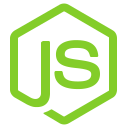

<p align="center">
    
    <h1 align="center"> Google Slides Generator </h1>
</p>

> A Google App Script that generates slides based on given templates

<h2> Table of Contents </h2>

- [Technologies Used](#technologies-used)
- [Setup](#setup)

## Technologies Used

<table>
<tbody>
    <tr align="center" valign="center">
        <td width="20.00000%" align="center">
            <a href="https://github.com/google/clasp">
                
            </a>
        </td>		
        <td width="20.00000%" align="center">
            <a href="https://nodejs.org/en">
                
            </a>
        </td>		
        <td width="20.00000%" align="center">
            <a href="https://www.typescriptlang.org/">
                
            </a>
        </td>		
        <td width="20.00000%" align="center">
            <a href="https://rollupjs.org/">
                
            </a>
        </td>		
        <td width="20.00000%" align="center">
            <a href="https://eslint.org/">
                
            </a>
        </td>		
    </tr>
    <tr align="center" valign="center">
        <td width="20.00000%" align="center">
            <a href="https://github.com/google/clasp">
                <b>
                    Clasp
                </b>
            </a>
        </td>
        <td width="20.00000%" align="center">
            <a href="https://nodejs.org/en">
                <b>
                    Node.js
                </b>
            </a>
        </td>
        <td width="20.00000%" align="center">
            <a href="https://www.typescriptlang.org/">
                <b>
                    Typescript
                </b>
            </a>
        </td>
        <td width="20.00000%" align="center">
            <a href="https://rollupjs.org/">
                <b>
                    Rollup
                </b>
            </a>
        </td>
        <td width="20.00000%" align="center">
            <a href="https://eslint.org/">
                <b>
                    ESLint
                </b>
            </a>
        </td>
    </tr>
</tbody>
</table>

## Setup

1. Run `npm i`
2. In this directory (the root directory for this repository), create a file named `.clasp.json` with the following contents

    ```json
    {
        "scriptId":"REPLACE_THIS_WITH_YOUR_SCRIPT_ID",
        "rootDir":"./dist"
    }
    ```

3. Run `npm run push` and confirm that the contents of the repo are properly pushed to the Google App Script project
